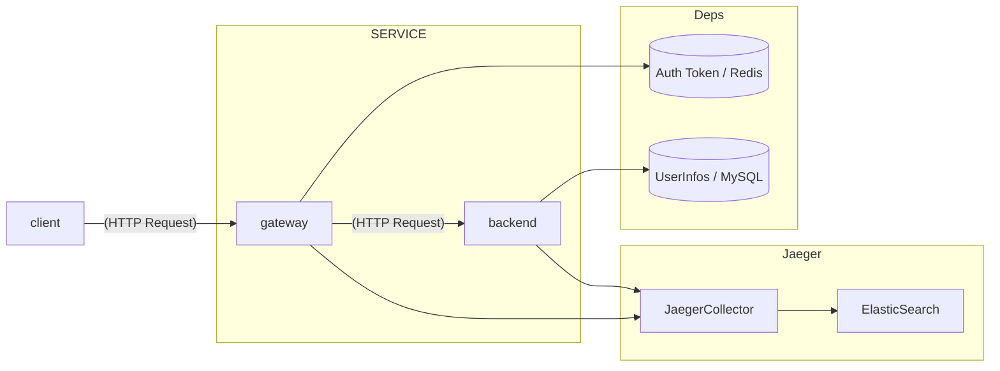

# Go 可观测性项目实例

使用 Go 演示一个可观测性项目。

## 技术栈

- Go
  - Gin 提供 HTTP Server
- 可观测性
  - metrics: Promethues, Grafana
  - trace: Jaeger, ElasticSearch
  - logging: Elastic Stack
- Docker 解决依赖问题

## 实例架构

该实例包含下列几部分：

1. client: 客户端，用户发起 HTTP 请求。
2. Service：服务端（我们需要开发的代码）。为了演示跨服务的调度，这里会创建两个组件。
   1. gateway: 网关层。在咱们的代码逻辑中会通过 Redis 进行用户请求访问的鉴权。
   2. backend: 业务处理层。在我们的示例代码中会访问 MySQL 数据库获取用户的信息。
3. Jaeger 集群：我们的 metrics 数据就放在这里。
4. Deps：第三方依赖组件，示例中会演示常用的组件 MySQL 和 Redis，这些组件的特点是组件内部对于我们来说是黑盒，我们无法修改组件来增加可观测性的指标。（有的组件可能支持可观测性的插件）
