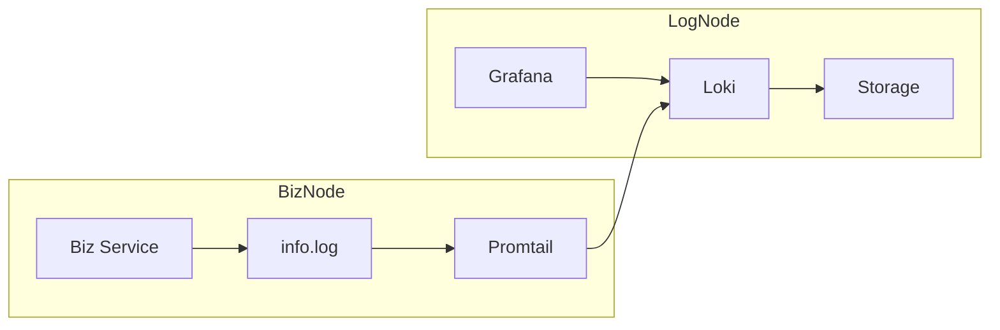

# 日志系统

根据官方的教程，使用 docker-compose 安装日志服务的组件，[参考资料](https://grafana.com/docs/loki/latest/setup/install/docker/)。


## 使用 docker-compose 部署日志系统

文件如下，`./docker-compose.yaml`，

```bash
docker compose up -d
```

* 打开 Grafana 地址：http://you-ip:3030
* 默认的 Grafana 账号密码：admin/admin


## 在业务服务中部署 Promtail 采集日志

业务服务会把日志文件输出到本地文件中，使用 Promtail 监听该文件，发送给 Loki 日志系统。

Promtail 的安装官方参考：https://grafana.com/docs/loki/latest/setup/install/local/

## 部署后业务节点和中心日志节点的关系



## 测试日志代码


## 配置 Promtail

由于日志文件输出在 /tmp/demo_log.log 下，

```
server:
  http_listen_port: 9080
  grpc_listen_port: 0

positions:
  filename: /tmp/positions.yaml

clients:
  - url: http://192.168.50.180:3100/loki/api/v1/push

scrape_configs:
- job_name: system
  static_configs:
  - targets:
      - localhost
    labels:
      job: varlogs
      __path__: /tmp/demo_log.log
```

* url: 是我部署 loki 的机器，修改成对应的地址即可。

配置好后，重启服务：

```bash
sudo systemctl restart promtail
```

## 查看日志

打开 Grafana 浏览器，选择 Explore 菜单，即可查看对应的日志了。